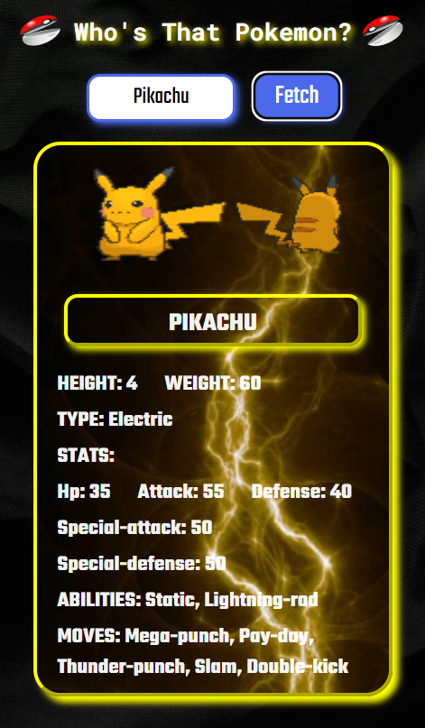
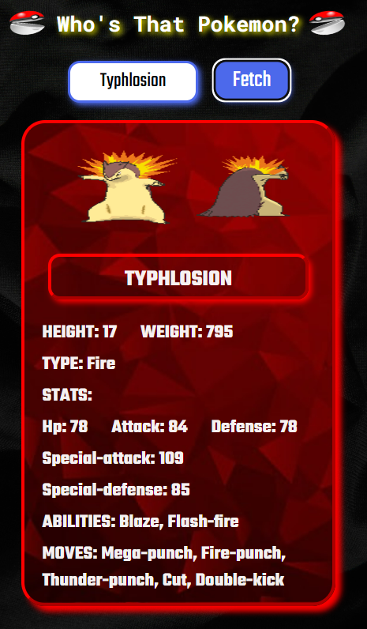
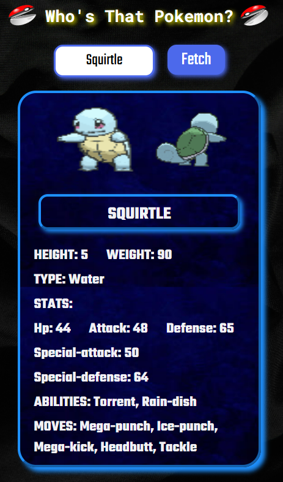
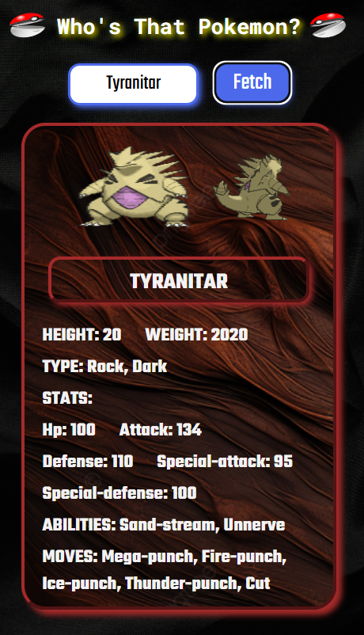
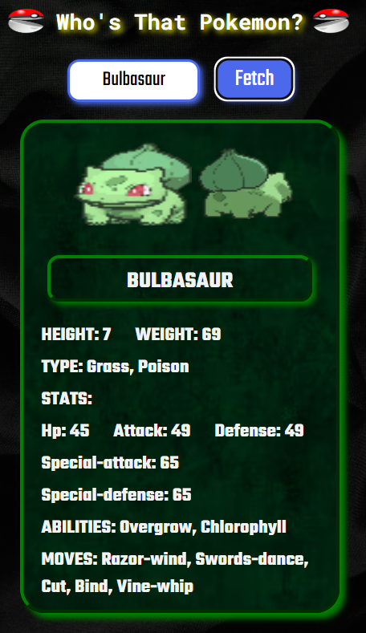
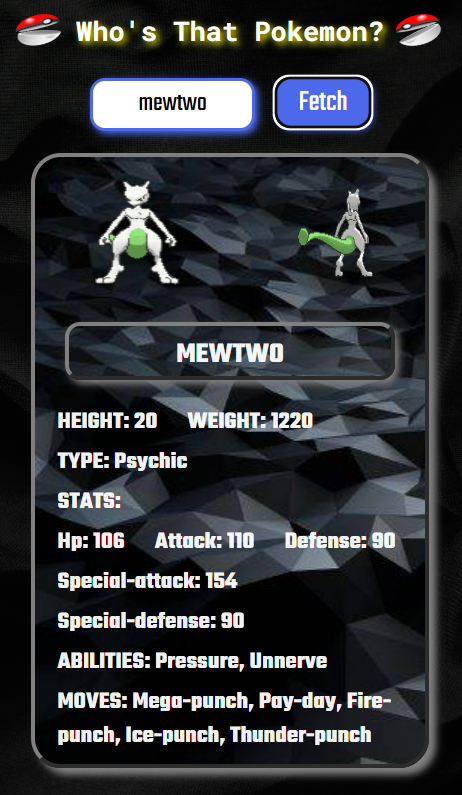
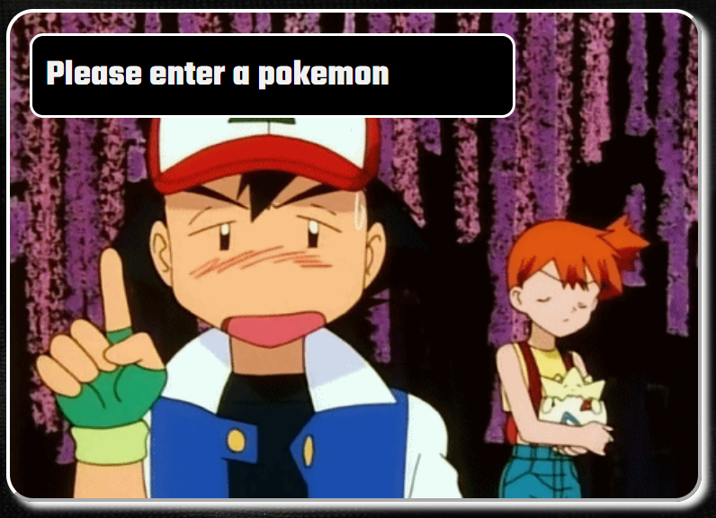
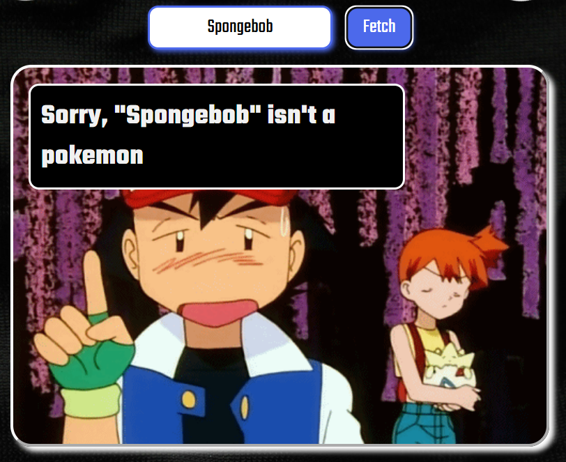

# Who's That Pokémon

### Generate SLEEK and AWESOME, dynamic Pokémon cards using real data from the PokéAPI!

This project dynamically generates cool Pokémon cards of your favourite Pokémon by fetching real-time data from the PokéAPI. Generate awesome and visually engaging cards with accurate stats, gifs, and descriptions!

### Choose your Pokémon!

### Generate Awesome Pokemon Cards!

### Features
- Ash asks you to enter a pokémon when you've not entered any value
- Ash also lets you know if you've entered any non-pokémon names in the input field
- Time to become a Pokémon Master!

